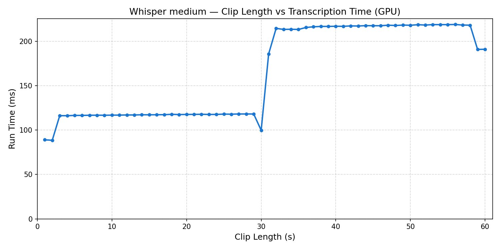

# Voice Transcription

An Android app built with Kotlin and Jetpack Compose that records audio, streams it in real-time to a Python gRPC server, and displays a live transcription using OpenAI Whisper running locally on GPU.

## Features

- Record audio via the device microphone
- Live transcription displayed in the app as you speak
- Sliding window transcription — Whisper re-transcribes a growing window every second, up to 15 seconds of context
- Optional local playback (toggle, off by default)
- Recordings can optionally be saved as WAV files (debug flag)
- All audio kept in memory — no temp files on device

## Architecture

MVVM with no XML layouts — all UI is written in Jetpack Compose.

```
android/app/src/main/java/com/voice/recorder/
├── MainActivity.kt
├── models/
│   ├── AppViewModel.kt        # State machine, transcription state
│   ├── AudioRecorderModel.kt  # Captures PCM via AudioRecord, emits Flow<ByteArray>
│   ├── AudioPlayerModel.kt    # Plays back PCM via AudioTrack
│   └── AudioUploadClient.kt   # Bidirectional gRPC streaming client
└── ui/
    └── MainScreen.kt          # Compose UI with live transcription box

server/
├── proto/audio.proto          # gRPC service definition
├── server.py                  # Receives audio, transcribes, streams text back
├── requirements.txt
└── generate_proto.sh          # Generates Python stubs
```

## Whisper Benchmark

Transcription time vs audio clip length for the `medium` model on GPU (RTX 5060):



## How the Sliding Window Transcription Works

Every second, Whisper re-transcribes a window of audio and the result replaces the full displayed text in the app. The window grows until it reaches 15 seconds, then slides forward:

```
t=1s   transcribes  [0s – 1s]
t=2s   transcribes  [0s – 2s]
t=3s   transcribes  [0s – 3s]
  ...
t=15s  transcribes  [0s – 15s]
t=16s  transcribes  [1s – 16s]   ← window starts sliding
t=17s  transcribes  [2s – 17s]
t=18s  transcribes  [3s – 18s]
  ...
```

**Why this works well:**
- Short clips (1–3s) give Whisper little context, so early results may be rough
- As the window grows toward 15 seconds, Whisper has more context and accuracy improves significantly
- Once the window is full, it slides forward maintaining a 15-second context at all times
- The 15-second cap keeps transcription time bounded — without it the window would grow indefinitely and eventually take longer to transcribe than the 1-second step interval

The displayed text always represents the most accurate transcription of the last 15 seconds of speech.

## Requirements

### Android
- Android SDK 34
- Min SDK 26 (Android 8.0)
- Java 17
- Gradle 8.7

### Server
- Python 3.8+
- NVIDIA GPU with CUDA (runs on CPU without one, but much slower)
- Device and server on the same WiFi network

## Setup

### Server

```bash
cd server
python -m venv .venv && source .venv/bin/activate
pip install -r requirements.txt
bash generate_proto.sh
python server.py
```

Transcriptions print to the console in real-time. To also save recordings as WAV files:

```bash
DEBUG_SAVE_WAV=true python server.py
```

### Android

Update `SERVER_HOST` in `AudioUploadClient.kt` with your machine's LAN IP, then:

```bash
cd android
./run.sh
```

This will build, install, and launch the app on a connected device or emulator.

## Permissions

- `RECORD_AUDIO` — requested at runtime on first launch
- `INTERNET` — required for gRPC streaming
